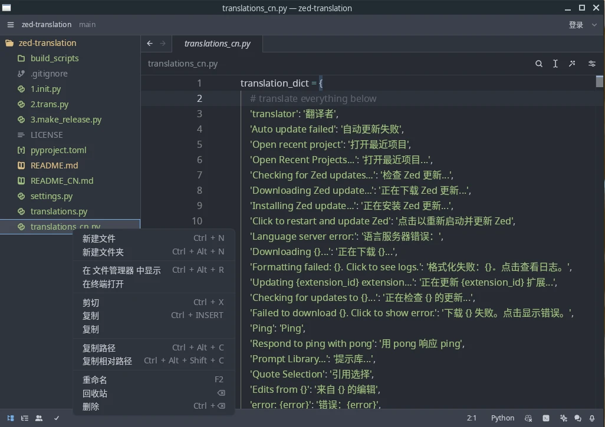

# 🌏 Zed Translation

<p align="center">
English | <a href="README_CN.md">简体中文</a>
</p>

This repository provides a translation for the awesome [Zed Editor](https://github.com/zed-industries/zed). If you'd
like to translate Zed into any language, please
follow [this guide](https://github.com/Nriver/zed-translation#how-to-translate). Currently, I have translated Zed into
Chinese.

Star this repository if you like it, thanks :)

# 🔔 Statement

The Zed Chinese localization version is currently only available through the following channels:

GitHub repository: https://github.com/Nriver/zed-translation

Archlinux AUR repository: https://aur.archlinux.org/packages/zed-cn-bin

# 🦮 Table of Contents

<!--ts-->
* [🌏 Zed Translation](#-zed-translation)
* [🔔 Statement](#-statement)
* [🦮 Table of Contents](#-table-of-contents)
* [📸 Screenshots](#-screenshots)
* [📚 How to use](#-how-to-use)
* [🌐 How does the translation work](#-how-does-the-translation-work)
* [🌐 How to translate](#-how-to-translate)
* [🛑 Limitations](#-limitations)
* [💰 Donation](#-donation)
* [🙏 Thanks](#-thanks)
<!--te-->

---

# 📸 Screenshots

Chinese


# 📚 How to use

1. Download the latest [Release](https://github.com/Nriver/zed-translation/releases) that suits your computer system.
2. Execute it (`zed` for Linux).
3. Enjoy :)

---

# 🌐 How does the translation work

It downloads the source code from the latest Zed official release and uses regular expressions to replace UI text in
each file. Then, it compiles the translated files back into the package. Done.

---

# 🌐 How to translate

First, make sure you can compile Zed. See https://zed.dev/docs/development/linux

Install Python 3.

Install the requirements.

```commandline
pip install -r requirements.txt
```

If you want to translate it to other languages, copy `translations.py` and rename it with the language name,
e.g., `translations_cn.py`. Then translate everything in it.

Change the `LANG` in `settings.py`.

Execute these commands to translate and compile Zed.

```commandline
python3 1.init.py
python3 2.trans.py
python3 3.make_release.py
```

You will get the translated Zed executable.

---

# 🛑 Limitations

- Some prompt message box fonts are hard-coded and do not follow the font settings. I'll post an issue on Zed.
- I do not have a Mac computer, so I cannot provide a MacOS build. Maybe I'll use GitHub Actions to build it in the
  future.

# 💰 Donation

Hello! If you appreciate my creations, kindly consider backing me. Your support is greatly appreciated. Thank you!

Alipay:  


Wechat Pay:  


Ko-fi:  
[](https://ko-fi.com/nriver)

---

# 🙏 Thanks

Thanks to every developer of the Zed project for creating a great editor.

Thanks to `alerque` for creating linux build scripts on [aur](https://aur.archlinux.org/packages/zed-git).

Thanks for the great IDE PyCharm from JetBrains.

[](https://jb.gg/OpenSource)
