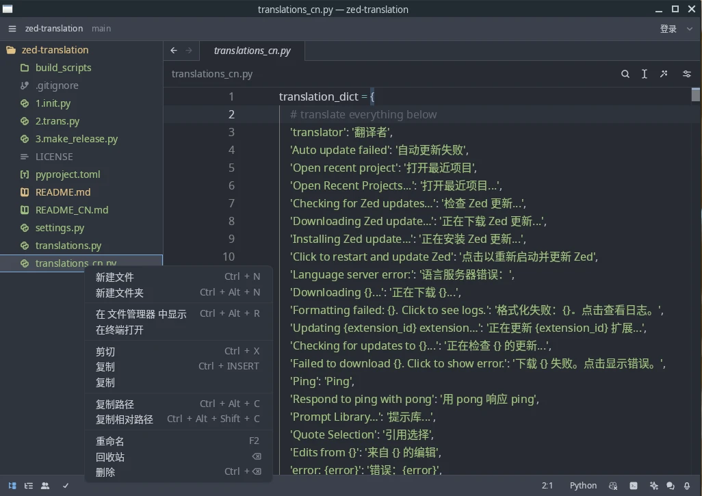

# 🌏 Zed Translation

<p align="center">
<a href="README.md">English</a> | 简体中文
</p>

我把这个牛逼的编辑器软件 [Zed 编辑器](https://github.com/zed-industries/zed) 做了中文翻译。如果你想将 Zed 翻译成其它语言，请参考[这个指南](https://github.com/Nriver/zed-translation#how-to-translate)。目前我已经完成了中文版的翻译。

如果你觉得不错, 可以留下一个star, 谢谢 ^_^

# 🔔 声明

Zed 汉化版目前只通过以下渠道发布:

Trilium Notes 汉化版 Github代码仓库 https://github.com/Nriver/zed-translation

Archlinux AUR 仓库 https://aur.archlinux.org/packages/zed-cn-bin

# 🦮 目录导航

<!--ts-->
* [🌏 Zed Translation](#-zed-translation)
* [🔔 声明](#-声明)
* [🦮 目录导航](#-目录导航)
* [📸 截图](#-截图)
* [📚 如何使用](#-如何使用)
   * [通过AUR安装](#通过aur安装)
   * [直接运行二进制文件](#直接运行二进制文件)
* [🌐 翻译原理](#-翻译原理)
* [🌐 如何翻译](#-如何翻译)
* [🛑 限制](#-限制)
* [💰 捐赠](#-捐赠)
* [🙏 感谢](#-感谢)
<!--te-->

---

# 📸 截图

中文


# 📚 如何使用

## 通过AUR安装

```
yay -S zed-cn-bin
```

## 直接运行二进制文件

1. 下载对应平台的最新 [Release](https://github.com/Nriver/zed-translation/releases) 。
2. 运行程序（Linux 系统中为 `zed`）。
3. 尽情享受吧 :)

---

# 🌐 翻译原理

从最新的 Zed 官方发布版下载源代码，然后用正则表达式替换每个文件中的 UI 文本。然后将翻译后的文件编译回软件包中。就酱。

---

# 🌐 如何翻译

首先，确保你能编译 Zed。请参阅 https://zed.dev/docs/development/linux

安装 Python 3。

安装所需的库。

```commandline
pip install -r requirements.txt
```

如果你想翻译成其他语言，复制 `translations.py` 并重命名为带有语言名称的文件，例如 `translations_cn.py`。然后翻译其中的所有内容。

在 `settings.py` 中更改 `LANG`。

执行以下命令以翻译并编译 Zed。
```commandline
python3 1.init.py
python3 2.trans.py
python3 3.make_release.py
```

你将获得翻译后的 Zed 可执行文件。

---

# 🛑 限制

- 某些提示消息框的字体是硬编码的，不会遵循字体设置。我会在 Zed 提交一个问题。
- 我没有 Mac 电脑，因此无法提供 MacOS 构建版本。也许将来会使用 GitHub Actions 来构建它。

# 💰 捐赠

您好！如果您欣赏我的创作，请考虑支持我。非常感谢您的支持。谢谢！

支付宝：  


微信支付：  


Ko-fi：  
[](https://ko-fi.com/nriver)

---
# 🙏 感谢

感谢 Zed 项目的每一位开发者创造了一个伟大的编辑器。

感谢 `alerque` 在 [aur](https://aur.archlinux.org/packages/zed-git) 上创建的linux编译脚本。

感谢 JetBrains 提供的优秀 IDE PyCharm。

[](https://jb.gg/OpenSource)
